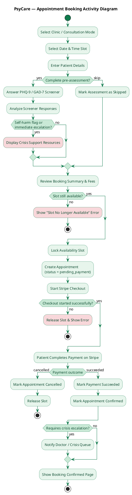

# PsyCare — Activity Diagram (Appointment Booking Flow)

Models the patient's end-to-end appointment booking journey — the most central workflow in the
app — from [`app/Http/Controllers/BookingController.php`](../../app/Http/Controllers/BookingController.php):
clinic selection → schedule → details → pre-assessment (PHQ-9/GAD-7 screener) → payment →
confirmation, including the crisis-escalation branch and slot-conflict/payment-failure paths. Same
PsyCare green theme as the other diagrams (`#0F7A4C` borders / `#E7F5EC` fills).

---

## 1. Mermaid

```mermaid
flowchart TD
    classDef startEnd fill:#0F7A4C,stroke:#0B4A2F,stroke-width:1.5px,color:#FFFFFF
    classDef action fill:#E7F5EC,stroke:#0F7A4C,stroke-width:1.2px,color:#0B4A2F
    classDef decision fill:#C9E9D6,stroke:#0F7A4C,stroke-width:1.5px,color:#0B4A2F
    classDef alert fill:#F8D7DA,stroke:#B02A37,stroke-width:1.5px,color:#5C151C

    Start([Start: Patient selects a Doctor]):::startEnd
    SelectClinic[Select Clinic / Consultation Mode]:::action
    SelectSchedule[Select Date & Time Slot]:::action
    EnterDetails[Enter Patient Details]:::action
    Assessment{Complete Pre-Assessment?}:::decision
    FillScreener[Answer PHQ-9 / GAD-7 Screener]:::action
    Skip[Mark Assessment as Skipped]:::action
    Analyze[Analyze Screener Responses]:::action
    RiskCheck{Self-harm flag or<br/>immediate escalation?}:::decision
    ShowCrisisResources[Display Crisis Support Resources]:::alert
    ReviewBooking[Review Booking Summary & Fees]:::action
    SlotCheck{Slot still available?}:::decision
    SlotTaken[Show 'Slot No Longer Available' Error]:::alert
    CreateAppointment[Create Appointment<br/>status = pending_payment]:::action
    LockSlot[Lock Availability Slot]:::action
    StartCheckout[Start Stripe Checkout]:::action
    CheckoutFail{Checkout started<br/>successfully?}:::decision
    ReleaseSlot[Release Slot & Show Error]:::alert
    PatientPays[Patient Completes Payment on Stripe]:::action
    PaymentResult{Payment outcome}:::decision
    MarkSucceeded[Mark Payment Succeeded &<br/>Appointment Confirmed]:::action
    MarkCancelled[Mark Appointment Cancelled &<br/>Release Slot]:::action
    NotifyCareTeam[Notify Doctor / Crisis Queue]:::action
    ShowConfirmation[Show Booking Confirmed Page]:::action
    End([End]):::startEnd

    Start --> SelectClinic --> SelectSchedule --> EnterDetails --> Assessment
    Assessment -- Yes --> FillScreener --> Analyze
    Assessment -- No, skip --> Skip --> ReviewBooking
    Analyze --> RiskCheck
    RiskCheck -- Yes --> ShowCrisisResources --> ReviewBooking
    RiskCheck -- No --> ReviewBooking

    ReviewBooking --> SlotCheck
    SlotCheck -- No --> SlotTaken --> SelectSchedule
    SlotCheck -- Yes --> LockSlot --> CreateAppointment --> StartCheckout
    StartCheckout --> CheckoutFail
    CheckoutFail -- No --> ReleaseSlot --> ReviewBooking
    CheckoutFail -- Yes --> PatientPays --> PaymentResult

    PaymentResult -- Success --> MarkSucceeded
    PaymentResult -- Cancelled --> MarkCancelled --> End

    MarkSucceeded --> RiskCheck2{Requires crisis<br/>escalation?}:::decision
    RiskCheck2 -- Yes --> NotifyCareTeam --> ShowConfirmation
    RiskCheck2 -- No --> ShowConfirmation
    ShowConfirmation --> End
```

---

## 2. PlantUML

---

## Notes for the report

- Based on the 5-step booking wizard in
  [`BookingController`](../../app/Http/Controllers/BookingController.php): `clinic` → `schedule` →
  `details` → `assessment` → `review`/`confirm`, plus
  [`PaymentCheckoutController`](../../app/Http/Controllers/PaymentCheckoutController.php) for the
  Stripe success/cancel callback.
- The pre-assessment is optional (`assessment.skipped` in session) — the diagram shows both the
  screener path and the skip path merging back into "Review Booking Summary".
- Risk detection uses [`ScreenerAnalyzer::analyze()`](../../app/Services/ScreenerAnalyzer.php) and
  [`Appointment::requiresCrisisEscalation()`](../../app/Models/Appointment.php) (self-harm flag OR
  immediate escalation) — shown as a decision node with a highlighted "Crisis Support Resources" /
  "Notify Doctor" alert path.
- The slot is locked (`lockForUpdate`) and the appointment created with `status = pending_payment`
  *before* redirecting to Stripe Checkout, inside a DB transaction — reflected here as the slot
  being locked/reserved before payment, with an explicit re-check path if another patient took the
  slot concurrently.
- This diagram covers the booking flow specifically. Let me know if you'd like a second activity
  diagram for another flow (e.g. AI Companion session, doctor therapy room session, doctor
  onboarding/approval).
