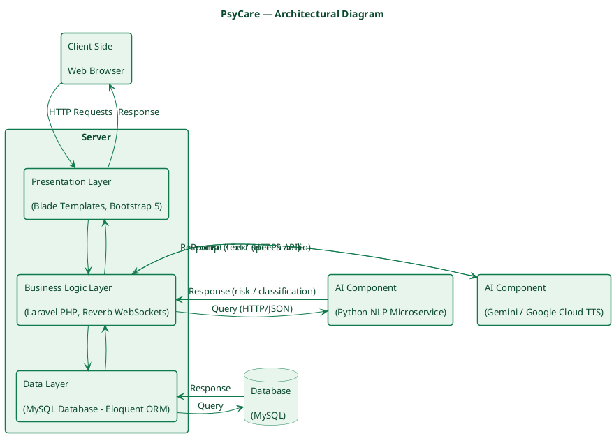
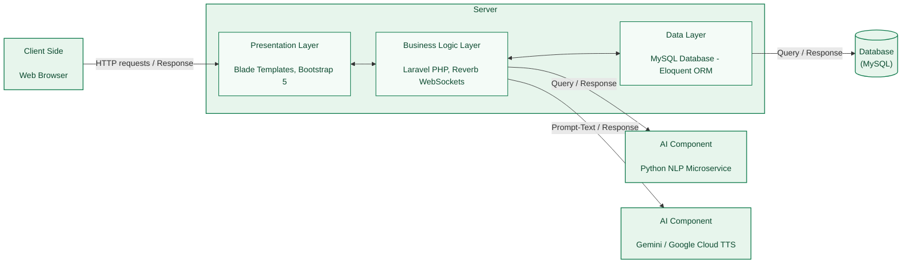

# PsyCare — System Architecture Diagram

Three-tier architecture (Presentation / Business Logic / Data), following the same layout style
as the reference diagram, adapted to PsyCare's actual stack:

- **Presentation Layer** — Blade templates (Laravel's default templating) + Bootstrap 5
- **Business Logic Layer** — Laravel (PHP) application server, plus Laravel Reverb for real-time
  WebSocket signaling (therapy room video/chat)
- **Data Layer** — MySQL database
- **AI Component (NLP Microservice)** — a separate in-house Python NLP microservice
  (`PSYCARE_NLP_API_URL`), called over HTTP for patient conversation/report risk classification
- **AI Component (Gemini / Google Cloud)** — external third-party AI services: Gemini (text
  generation) and Google Cloud Text-to-Speech, called directly from the Business Logic Layer for
  the AI Companion's conversational + voice features

Colour theme: PsyCare green (`#0F7A4C` borders / `#E7F5EC` fills), matching the brand palette used
across the app UI.

---

## 1. PlantUML

Render with the PlantUML extension/CLI, or paste into https://www.plantuml.com/plantuml (only if
you're comfortable sharing this diagram externally — otherwise render locally).

---

## 2. Mermaid

Renders natively on GitHub and in most Markdown viewers.

---

## Notes for the report

- The **AI Component (Python NLP Microservice)** box represents the standalone, in-house Python
  NLP service (`PSYCARE_NLP_API_URL`, called from
  [`app/Services/PatientNlpClassifier.php`](../../app/Services/PatientNlpClassifier.php)) used for
  patient conversation risk classification and NLP report generation.
- The **AI Component (Gemini / Google Cloud TTS)** box represents the external third-party AI
  providers used by the AI Companion for conversational text generation and speech synthesis (see
  [`app/Services/AiCompanion.php`](../../app/Services/AiCompanion.php),
  [`GeminiTextToSpeech.php`](../../app/Services/GeminiTextToSpeech.php),
  [`GoogleTextToSpeech.php`](../../app/Services/GoogleTextToSpeech.php)). These are shown as a
  separate box from the NLP microservice because they're a different system boundary — external
  vendor APIs rather than an in-house service.
- Reverb is included in the Business Logic Layer since it's the real-time signaling channel for
  therapy room video/chat (see [`routes/channels.php`](../../routes/channels.php)); call it out as
  its own box if your report needs that level of detail.
