# PsyCare — Class Diagram

Simplified, flat ER-style class diagram (no packages, no method lists — just key fields and
relationships), matching the reference layout. Derived from the Eloquent models in
[`app/Models`](../../app/Models). Same PsyCare green theme as the other diagrams (`#0F7A4C`
borders / `#E7F5EC` fills).

---

## 1. Mermaid

```mermaid
classDiagram
    class User {
        name : string
        email : string
        mobile : string
        is_banned : bool
    }

    class Doctor {
        name : string
        email : string
        license_number : string
        specialization : string
        consultation_fee : decimal
        status : string
    }

    class MedicalCenter {
        name : string
        email : string
        registration_number : string
        status : string
        facility_fee : decimal
    }

    class ClinicStaff {
        name : string
        email : string
        status : string
    }

    class Admin {
        name : string
        email : string
    }

    class DoctorClinicAffiliation {
        status : string
        requested_by_clinic_at : datetime
        responded_by_doctor_at : datetime
    }

    class DoctorAvailabilitySlot {
        date : date
        start_time : string
        end_time : string
        is_booked : bool
    }

    class DoctorPayout {
        amount : decimal
        payment_count : int
        paid_at : datetime
        status : string
    }

    class Appointment {
        appointment_date : date
        appointment_time : string
        mode : string
        status : string
        pre_assessment_risk_level : string
        self_harm_flag : bool
    }

    class ScreenerDraft {
        answers : array
        current_question : string
        language : string
    }

    class Prescription {
        notes : string
        issued_at : datetime
    }

    class PrescriptionItem {
        medicine_name : string
        dosage : string
        frequency : string
        duration : string
    }

    class PatientConsent {
        granted_at : datetime
        revoked_at : datetime
    }

    class MoodEntry {
        mood_score : int
        mood_tags : array
        entry_date : date
    }

    class Payment {
        stripe_session_id : string
        amount : decimal
        currency : string
        status : string
        doctor_payout_status : string
    }

    class AiCompanionSession {
        public_id : string
        language : string
        consented_at : datetime
        ended_at : datetime
    }

    class AiCompanionTurn {
        role : string
        sequence : int
        content : string
    }

    class PatientNlpReport {
        status : string
        schema_version : string
        generated_at : datetime
    }

    class NlpClassificationResult {
        entry_date : date
        risk_level : string
        self_harm_flag : bool
    }

    class TherapyRoom {
        title : string
        topic : string
        status : string
        scheduled_at : datetime
        duration_minutes : int
    }

    class TherapyRoomParticipant {
        anonymous_label : string
        join_order : int
        removed_at : datetime
    }

    User "1" -- "*" Appointment
    User "1" -- "*" Payment
    User "1" -- "*" MoodEntry
    User "1" -- "*" PatientConsent
    User "1" -- "*" Prescription
    User "1" -- "*" AiCompanionSession
    User "1" -- "*" PatientNlpReport
    User "1" -- "*" NlpClassificationResult
    User "1" -- "*" ScreenerDraft
    User "1" -- "*" TherapyRoomParticipant

    Doctor "1" -- "*" Appointment
    Doctor "1" -- "*" DoctorAvailabilitySlot
    Doctor "1" -- "*" DoctorClinicAffiliation
    Doctor "1" -- "*" DoctorPayout
    Doctor "1" -- "*" Payment
    Doctor "1" -- "*" Prescription
    Doctor "1" -- "*" PatientConsent
    Doctor "1" -- "*" TherapyRoom
    Doctor "1" -- "*" ScreenerDraft
    Doctor "*" -- "1" Admin

    MedicalCenter "1" -- "*" ClinicStaff
    MedicalCenter "1" -- "*" Appointment
    MedicalCenter "1" -- "*" DoctorPayout
    MedicalCenter "1" -- "*" Payment
    MedicalCenter "1" -- "*" DoctorAvailabilitySlot
    MedicalCenter "1" -- "*" TherapyRoom
    MedicalCenter "1" -- "*" DoctorClinicAffiliation

    Appointment "1" -- "1" DoctorAvailabilitySlot
    Appointment "1" -- "0..1" Prescription
    Appointment "1" -- "0..1" Payment
    Appointment "1" -- "*" PatientNlpReport

    Prescription "1" -- "*" PrescriptionItem

    Payment "*" -- "0..1" DoctorPayout

    AiCompanionSession "1" -- "*" AiCompanionTurn
    AiCompanionSession "1" -- "0..1" PatientNlpReport
    AiCompanionSession "1" -- "0..1" NlpClassificationResult

    TherapyRoom "1" -- "*" TherapyRoomParticipant
```

---

## 2. PlantUML

```plantuml
@startuml PsyCare_ClassDiagram
skinparam backgroundColor #FFFFFF
skinparam shadowing false
skinparam roundcorner 4
skinparam defaultFontName Helvetica
skinparam defaultFontSize 11
skinparam linetype ortho

skinparam class {
  BorderColor #0F7A4C
  BackgroundColor #E7F5EC
  FontColor #0B4A2F
  ArrowColor #0F7A4C
  HeaderBackgroundColor #2E9E5B
  AttributeFontColor #0B4A2F
}

hide circle
hide methods

class User {
  name : string
  email : string
  mobile : string
  is_banned : bool
}

class Doctor {
  name : string
  email : string
  license_number : string
  specialization : string
  consultation_fee : decimal
  status : string
}

class MedicalCenter {
  name : string
  email : string
  registration_number : string
  status : string
  facility_fee : decimal
}

class ClinicStaff {
  name : string
  email : string
  status : string
}

class Admin {
  name : string
  email : string
}

class DoctorClinicAffiliation {
  status : string
  requested_by_clinic_at : datetime
  responded_by_doctor_at : datetime
}

class DoctorAvailabilitySlot {
  date : date
  start_time : string
  end_time : string
  is_booked : bool
}

class DoctorPayout {
  amount : decimal
  payment_count : int
  paid_at : datetime
  status : string
}

class Appointment {
  appointment_date : date
  appointment_time : string
  mode : string
  status : string
  pre_assessment_risk_level : string
  self_harm_flag : bool
}

class ScreenerDraft {
  answers : array
  current_question : string
  language : string
}

class Prescription {
  notes : string
  issued_at : datetime
}

class PrescriptionItem {
  medicine_name : string
  dosage : string
  frequency : string
  duration : string
}

class PatientConsent {
  granted_at : datetime
  revoked_at : datetime
}

class MoodEntry {
  mood_score : int
  mood_tags : array
  entry_date : date
}

class Payment {
  stripe_session_id : string
  amount : decimal
  currency : string
  status : string
  doctor_payout_status : string
}

class AiCompanionSession {
  public_id : string
  language : string
  consented_at : datetime
  ended_at : datetime
}

class AiCompanionTurn {
  role : string
  sequence : int
  content : string
}

class PatientNlpReport {
  status : string
  schema_version : string
  generated_at : datetime
}

class NlpClassificationResult {
  entry_date : date
  risk_level : string
  self_harm_flag : bool
}

class TherapyRoom {
  title : string
  topic : string
  status : string
  scheduled_at : datetime
  duration_minutes : int
}

class TherapyRoomParticipant {
  anonymous_label : string
  join_order : int
  removed_at : datetime
}

User "1" -- "*" Appointment
User "1" -- "*" Payment
User "1" -- "*" MoodEntry
User "1" -- "*" PatientConsent
User "1" -- "*" Prescription
User "1" -- "*" AiCompanionSession
User "1" -- "*" PatientNlpReport
User "1" -- "*" NlpClassificationResult
User "1" -- "*" ScreenerDraft
User "1" -- "*" TherapyRoomParticipant

Doctor "1" -- "*" Appointment
Doctor "1" -- "*" DoctorAvailabilitySlot
Doctor "1" -- "*" DoctorClinicAffiliation
Doctor "1" -- "*" DoctorPayout
Doctor "1" -- "*" Payment
Doctor "1" -- "*" Prescription
Doctor "1" -- "*" PatientConsent
Doctor "1" -- "*" TherapyRoom
Doctor "1" -- "*" ScreenerDraft
Doctor "*" -- "1" Admin

MedicalCenter "1" -- "*" ClinicStaff
MedicalCenter "1" -- "*" Appointment
MedicalCenter "1" -- "*" DoctorPayout
MedicalCenter "1" -- "*" Payment
MedicalCenter "1" -- "*" DoctorAvailabilitySlot
MedicalCenter "1" -- "*" TherapyRoom
MedicalCenter "1" -- "*" DoctorClinicAffiliation

Appointment "1" -- "1" DoctorAvailabilitySlot
Appointment "1" -- "0..1" Prescription
Appointment "1" -- "0..1" Payment
Appointment "1" -- "*" PatientNlpReport

Prescription "1" -- "*" PrescriptionItem

Payment "*" -- "0..1" DoctorPayout

AiCompanionSession "1" -- "*" AiCompanionTurn
AiCompanionSession "1" -- "0..1" PatientNlpReport
AiCompanionSession "1" -- "0..1" NlpClassificationResult

TherapyRoom "1" -- "*" TherapyRoomParticipant

@enduml
```

---

## Notes for the report

- Flattened to one canvas (no package grouping, no method lists) to match the simpler reference
  layout — just class name, key fields, and cardinality-labeled association lines.
- All 21 models from [`app/Models`](../../app/Models) are present; attributes are trimmed to the
  handful of fields most useful for a report. Full field lists are in the model files/migrations.
- `DoctorClinicAffiliation` and `TherapyRoomParticipant` are the pivot/association records behind
  the Doctor↔MedicalCenter and TherapyRoom↔User many-to-many relationships.
