# PsyCare — Entity Relationship Diagram

Complete ER diagram covering all 21 domain tables, derived from `database/migrations/` and the
Eloquent relationships in [`app/Models`](../../app/Models) (superseding the older, partial version
at [`docs/er-diagram/ER_DIAGRAM.md`](../er-diagram/ER_DIAGRAM.md), which predates several models).
Same PsyCare green theme as the other diagrams (`#0F7A4C` borders / `#E7F5EC` fills).

Laravel infrastructure tables (`cache`, `jobs`, `sessions`, `migrations`,
`password_reset_tokens`, etc.) are intentionally omitted — no domain meaning. Only keys and a
handful of type-defining columns are shown per entity to keep it readable; full column lists live
in the migrations.

---

## 1. Mermaid

```mermaid
erDiagram
    ADMINS ||--o{ DOCTORS : approves
    ADMINS ||--o{ MEDICAL_CENTERS : approves

    MEDICAL_CENTERS ||--o{ CLINIC_STAFF : employs
    MEDICAL_CENTERS ||--o{ APPOINTMENTS : hosts
    MEDICAL_CENTERS ||--o{ DOCTOR_AVAILABILITY_SLOTS : provides
    MEDICAL_CENTERS ||--o{ DOCTOR_PAYOUTS : issues
    MEDICAL_CENTERS ||--o{ PAYMENTS : collects
    MEDICAL_CENTERS ||--o{ PRESCRIPTIONS : "issued at"
    MEDICAL_CENTERS ||--o{ THERAPY_ROOMS : hosts
    MEDICAL_CENTERS ||--o{ DOCTOR_CLINIC_AFFILIATIONS : requests

    DOCTORS ||--o{ APPOINTMENTS : attends
    DOCTORS ||--o{ DOCTOR_AVAILABILITY_SLOTS : defines
    DOCTORS ||--o{ DOCTOR_CLINIC_AFFILIATIONS : responds
    DOCTORS ||--o{ DOCTOR_PAYOUTS : receives
    DOCTORS ||--o{ PAYMENTS : earns
    DOCTORS ||--o{ PRESCRIPTIONS : issues
    DOCTORS ||--o{ PATIENT_CONSENTS : receives
    DOCTORS ||--o{ SCREENER_DRAFTS : "is assigned in"
    DOCTORS ||--o{ THERAPY_ROOMS : hosts

    USERS ||--o{ APPOINTMENTS : books
    USERS ||--o{ PAYMENTS : pays
    USERS ||--o{ MOOD_ENTRIES : logs
    USERS ||--o{ PATIENT_CONSENTS : grants
    USERS ||--o{ PRESCRIPTIONS : receives
    USERS ||--o{ SCREENER_DRAFTS : fills
    USERS ||--o{ AI_COMPANION_SESSIONS : starts
    USERS ||--o{ PATIENT_NLP_REPORTS : "is subject of"
    USERS ||--o{ NLP_CLASSIFICATION_RESULTS : "is subject of"
    USERS ||--o{ THERAPY_ROOM_PARTICIPANTS : joins

    APPOINTMENTS ||--o| DOCTOR_AVAILABILITY_SLOTS : occupies
    APPOINTMENTS ||--o| PRESCRIPTIONS : "results in"
    APPOINTMENTS ||--o| PAYMENTS : "paid by"
    APPOINTMENTS ||--o{ PATIENT_NLP_REPORTS : generates

    PRESCRIPTIONS ||--o{ PRESCRIPTION_ITEMS : contains

    PAYMENTS }o--o| DOCTOR_PAYOUTS : "settled in"

    AI_COMPANION_SESSIONS ||--o{ AI_COMPANION_TURNS : contains
    AI_COMPANION_SESSIONS ||--o| PATIENT_NLP_REPORTS : produces
    AI_COMPANION_SESSIONS ||--o| NLP_CLASSIFICATION_RESULTS : produces

    THERAPY_ROOMS ||--o{ THERAPY_ROOM_PARTICIPANTS : contains

    ADMINS {
        bigint id PK
        string name
        string email
    }

    MEDICAL_CENTERS {
        bigint id PK
        string name
        string registration_number
        string status
        decimal facility_fee
    }

    CLINIC_STAFF {
        bigint id PK
        bigint medical_center_id FK
        string name
        string status
    }

    DOCTORS {
        bigint id PK
        bigint approved_by FK
        string name
        string license_number
        string status
        decimal consultation_fee
        string onboarding_step
    }

    DOCTOR_CLINIC_AFFILIATIONS {
        bigint id PK
        bigint doctor_id FK
        bigint clinic_id FK
        string status
        datetime requested_by_clinic_at
        datetime responded_by_doctor_at
    }

    DOCTOR_AVAILABILITY_SLOTS {
        bigint id PK
        bigint doctor_id FK
        bigint clinic_id FK
        bigint appointment_id FK
        date date
        string start_time
        boolean is_booked
    }

    DOCTOR_PAYOUTS {
        bigint id PK
        bigint clinic_id FK
        bigint doctor_id FK
        decimal amount
        string status
        datetime paid_at
    }

    USERS {
        bigint id PK
        string name
        string email
        boolean is_banned
    }

    APPOINTMENTS {
        bigint id PK
        bigint user_id FK
        bigint doctor_id FK
        bigint medical_center_id FK
        bigint doctor_availability_slot_id FK
        date appointment_date
        string status
        boolean self_harm_flag
        boolean requires_immediate_escalation
    }

    PAYMENTS {
        bigint id PK
        bigint appointment_id FK
        bigint doctor_id FK
        bigint clinic_id FK
        bigint patient_id FK
        bigint doctor_payout_id FK
        decimal amount
        string status
        string doctor_payout_status
    }

    PRESCRIPTIONS {
        bigint id PK
        bigint appointment_id FK
        bigint doctor_id FK
        bigint patient_id FK
        bigint clinic_id FK
        datetime issued_at
    }

    PRESCRIPTION_ITEMS {
        bigint id PK
        bigint prescription_id FK
        string medicine_name
        string dosage
    }

    PATIENT_CONSENTS {
        bigint id PK
        bigint patient_id FK
        bigint doctor_id FK
        datetime granted_at
        datetime revoked_at
    }

    MOOD_ENTRIES {
        bigint id PK
        bigint patient_id FK
        int mood_score
        date entry_date
    }

    SCREENER_DRAFTS {
        bigint id PK
        bigint user_id FK
        bigint doctor_id FK
        json answers
    }

    AI_COMPANION_SESSIONS {
        bigint id PK
        bigint user_id FK
        string public_id
        datetime ended_at
    }

    AI_COMPANION_TURNS {
        bigint id PK
        bigint ai_companion_session_id FK
        string role
        int sequence
    }

    PATIENT_NLP_REPORTS {
        bigint id PK
        bigint user_id FK
        bigint appointment_id FK
        bigint ai_companion_session_id FK
        string status
    }

    NLP_CLASSIFICATION_RESULTS {
        bigint id PK
        bigint patient_id FK
        bigint ai_companion_session_id FK
        string risk_level
        boolean self_harm_flag
    }

    THERAPY_ROOMS {
        bigint id PK
        bigint doctor_id FK
        bigint medical_center_id FK
        string status
        datetime scheduled_at
    }

    THERAPY_ROOM_PARTICIPANTS {
        bigint id PK
        bigint therapy_room_id FK
        bigint patient_id FK
        string anonymous_label
        datetime removed_at
    }
```

---

## 2. PlantUML

```plantuml
@startuml PsyCare_ERDiagram
skinparam backgroundColor #FFFFFF
skinparam shadowing false
skinparam roundcorner 4
skinparam defaultFontName Helvetica
skinparam defaultFontSize 11
skinparam linetype ortho

skinparam class {
  BorderColor #0F7A4C
  BackgroundColor #E7F5EC
  FontColor #0B4A2F
  ArrowColor #0F7A4C
  HeaderBackgroundColor #2E9E5B
  AttributeFontColor #0B4A2F
}

hide methods
hide circle

entity ADMINS {
  * id : bigint <<PK>>
  --
  name : string
  email : string
}

entity MEDICAL_CENTERS {
  * id : bigint <<PK>>
  --
  name : string
  registration_number : string
  status : string
  facility_fee : decimal
}

entity CLINIC_STAFF {
  * id : bigint <<PK>>
  --
  # medical_center_id : bigint <<FK>>
  name : string
  status : string
}

entity DOCTORS {
  * id : bigint <<PK>>
  --
  # approved_by : bigint <<FK>>
  name : string
  license_number : string
  status : string
  consultation_fee : decimal
  onboarding_step : string
}

entity DOCTOR_CLINIC_AFFILIATIONS {
  * id : bigint <<PK>>
  --
  # doctor_id : bigint <<FK>>
  # clinic_id : bigint <<FK>>
  status : string
  requested_by_clinic_at : datetime
  responded_by_doctor_at : datetime
}

entity DOCTOR_AVAILABILITY_SLOTS {
  * id : bigint <<PK>>
  --
  # doctor_id : bigint <<FK>>
  # clinic_id : bigint <<FK>>
  # appointment_id : bigint <<FK>>
  date : date
  start_time : string
  is_booked : boolean
}

entity DOCTOR_PAYOUTS {
  * id : bigint <<PK>>
  --
  # clinic_id : bigint <<FK>>
  # doctor_id : bigint <<FK>>
  amount : decimal
  status : string
  paid_at : datetime
}

entity USERS {
  * id : bigint <<PK>>
  --
  name : string
  email : string
  is_banned : boolean
}

entity APPOINTMENTS {
  * id : bigint <<PK>>
  --
  # user_id : bigint <<FK>>
  # doctor_id : bigint <<FK>>
  # medical_center_id : bigint <<FK>>
  # doctor_availability_slot_id : bigint <<FK>>
  appointment_date : date
  status : string
  self_harm_flag : boolean
  requires_immediate_escalation : boolean
}

entity PAYMENTS {
  * id : bigint <<PK>>
  --
  # appointment_id : bigint <<FK>>
  # doctor_id : bigint <<FK>>
  # clinic_id : bigint <<FK>>
  # patient_id : bigint <<FK>>
  # doctor_payout_id : bigint <<FK>>
  amount : decimal
  status : string
  doctor_payout_status : string
}

entity PRESCRIPTIONS {
  * id : bigint <<PK>>
  --
  # appointment_id : bigint <<FK>>
  # doctor_id : bigint <<FK>>
  # patient_id : bigint <<FK>>
  # clinic_id : bigint <<FK>>
  issued_at : datetime
}

entity PRESCRIPTION_ITEMS {
  * id : bigint <<PK>>
  --
  # prescription_id : bigint <<FK>>
  medicine_name : string
  dosage : string
}

entity PATIENT_CONSENTS {
  * id : bigint <<PK>>
  --
  # patient_id : bigint <<FK>>
  # doctor_id : bigint <<FK>>
  granted_at : datetime
  revoked_at : datetime
}

entity MOOD_ENTRIES {
  * id : bigint <<PK>>
  --
  # patient_id : bigint <<FK>>
  mood_score : int
  entry_date : date
}

entity SCREENER_DRAFTS {
  * id : bigint <<PK>>
  --
  # user_id : bigint <<FK>>
  # doctor_id : bigint <<FK>>
  answers : json
}

entity AI_COMPANION_SESSIONS {
  * id : bigint <<PK>>
  --
  # user_id : bigint <<FK>>
  public_id : string
  ended_at : datetime
}

entity AI_COMPANION_TURNS {
  * id : bigint <<PK>>
  --
  # ai_companion_session_id : bigint <<FK>>
  role : string
  sequence : int
}

entity PATIENT_NLP_REPORTS {
  * id : bigint <<PK>>
  --
  # user_id : bigint <<FK>>
  # appointment_id : bigint <<FK>>
  # ai_companion_session_id : bigint <<FK>>
  status : string
}

entity NLP_CLASSIFICATION_RESULTS {
  * id : bigint <<PK>>
  --
  # patient_id : bigint <<FK>>
  # ai_companion_session_id : bigint <<FK>>
  risk_level : string
  self_harm_flag : boolean
}

entity THERAPY_ROOMS {
  * id : bigint <<PK>>
  --
  # doctor_id : bigint <<FK>>
  # medical_center_id : bigint <<FK>>
  status : string
  scheduled_at : datetime
}

entity THERAPY_ROOM_PARTICIPANTS {
  * id : bigint <<PK>>
  --
  # therapy_room_id : bigint <<FK>>
  # patient_id : bigint <<FK>>
  anonymous_label : string
  removed_at : datetime
}

ADMINS ||--o{ DOCTORS : approves
ADMINS ||--o{ MEDICAL_CENTERS : approves

MEDICAL_CENTERS ||--o{ CLINIC_STAFF : employs
MEDICAL_CENTERS ||--o{ APPOINTMENTS : hosts
MEDICAL_CENTERS ||--o{ DOCTOR_AVAILABILITY_SLOTS : provides
MEDICAL_CENTERS ||--o{ DOCTOR_PAYOUTS : issues
MEDICAL_CENTERS ||--o{ PAYMENTS : collects
MEDICAL_CENTERS ||--o{ PRESCRIPTIONS : "issued at"
MEDICAL_CENTERS ||--o{ THERAPY_ROOMS : hosts
MEDICAL_CENTERS ||--o{ DOCTOR_CLINIC_AFFILIATIONS : requests

DOCTORS ||--o{ APPOINTMENTS : attends
DOCTORS ||--o{ DOCTOR_AVAILABILITY_SLOTS : defines
DOCTORS ||--o{ DOCTOR_CLINIC_AFFILIATIONS : responds
DOCTORS ||--o{ DOCTOR_PAYOUTS : receives
DOCTORS ||--o{ PAYMENTS : earns
DOCTORS ||--o{ PRESCRIPTIONS : issues
DOCTORS ||--o{ PATIENT_CONSENTS : receives
DOCTORS ||--o{ SCREENER_DRAFTS : "is assigned in"
DOCTORS ||--o{ THERAPY_ROOMS : hosts

USERS ||--o{ APPOINTMENTS : books
USERS ||--o{ PAYMENTS : pays
USERS ||--o{ MOOD_ENTRIES : logs
USERS ||--o{ PATIENT_CONSENTS : grants
USERS ||--o{ PRESCRIPTIONS : receives
USERS ||--o{ SCREENER_DRAFTS : fills
USERS ||--o{ AI_COMPANION_SESSIONS : starts
USERS ||--o{ PATIENT_NLP_REPORTS : "is subject of"
USERS ||--o{ NLP_CLASSIFICATION_RESULTS : "is subject of"
USERS ||--o{ THERAPY_ROOM_PARTICIPANTS : joins

APPOINTMENTS |o--o| DOCTOR_AVAILABILITY_SLOTS : occupies
APPOINTMENTS |o--o| PRESCRIPTIONS : "results in"
APPOINTMENTS |o--o| PAYMENTS : "paid by"
APPOINTMENTS ||--o{ PATIENT_NLP_REPORTS : generates

PRESCRIPTIONS ||--o{ PRESCRIPTION_ITEMS : contains

PAYMENTS }o--o| DOCTOR_PAYOUTS : "settled in"

AI_COMPANION_SESSIONS ||--o{ AI_COMPANION_TURNS : contains
AI_COMPANION_SESSIONS ||--o| PATIENT_NLP_REPORTS : produces
AI_COMPANION_SESSIONS ||--o| NLP_CLASSIFICATION_RESULTS : produces

THERAPY_ROOMS ||--o{ THERAPY_ROOM_PARTICIPANTS : contains

@enduml
```

---

## Notes for the report

- All 21 domain tables from [`app/Models`](../../app/Models) are represented — this diagram
  supersedes [`docs/er-diagram/ER_DIAGRAM.md`](../er-diagram/ER_DIAGRAM.md), which predates the
  clinical/payment tables (Payment, Prescription, PrescriptionItem, DoctorClinicAffiliation,
  DoctorAvailabilitySlot, DoctorPayout, MoodEntry, PatientConsent, ClinicStaff).
- **DOCTOR_CLINIC_AFFILIATIONS** and **THERAPY_ROOM_PARTICIPANTS** are the association/pivot
  tables realizing the two many-to-many relationships in the schema: Doctor↔MedicalCenter and
  TherapyRoom↔User respectively — both carry real business data (status/timestamps, anonymous
  labels), so they're modeled as first-class entities rather than implicit link tables.
- **ADMINS** connects outward only (approves Doctors and MedicalCenters via `approved_by`); it has
  no inbound foreign keys from other domain tables.
- **NOTIFICATIONS** (Laravel's polymorphic notifications table) is intentionally omitted from the
  diagram since it has no fixed FK — it references whichever notifiable model
  (Doctor/User/MedicalCenter) triggered it via `notifiable_type`/`notifiable_id`.
- Cardinalities: `APPOINTMENTS ↔ DOCTOR_AVAILABILITY_SLOTS / PRESCRIPTIONS / PAYMENTS` are 1-to-0..1
  (an appointment occupies one slot, may have one prescription, may have one payment); `PAYMENTS ↔
  DOCTOR_PAYOUTS` is many-to-0..1 (many payments settle into one payout batch); everything else
  shown is a standard 1-to-many.
- Only key/type-defining columns are shown per entity to keep the diagram legible — the full column
  list for every table lives in `database/migrations/`.
