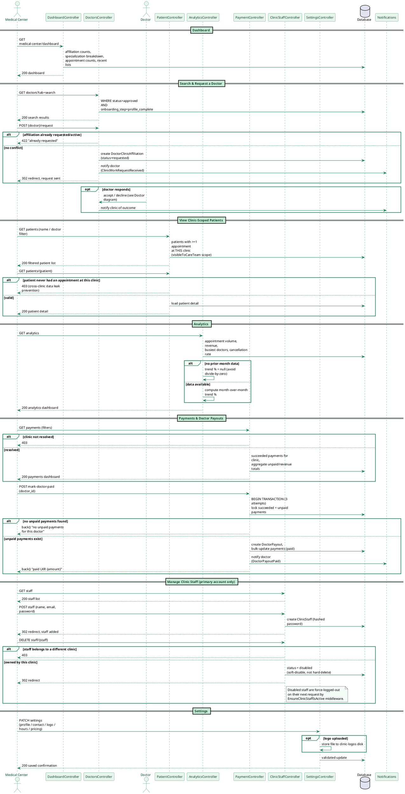

# PsyCare — Sequence Diagrams

Five professional sequence diagrams: one dedicated to **authentication across all five guards**,
then one comprehensive diagram per role (**Patient**, **Doctor**, **Medical Center**, **Super
Admin**) covering every major function of that role, with real `alt`/`opt`/`loop` branches —
validation failures, authorization gates, and fallback paths — pulled directly from the actual
controllers/services/middleware. PlantUML only. Same PsyCare green theme as the other diagrams
(`#0F7A4C` borders / `#E7F5EC` fills).

---

## 1. Authentication — All Roles

Covers register + login for all 5 guards (`web`=Patient, `doctor`, `medical_center`,
`clinic_staff`, `admin`), including the runtime re-check middleware that force-logs-out a user if
their status changes mid-session (ban, de-approval, staff disable).

```plantuml
@startuml Auth_Sequence
skinparam backgroundColor #FFFFFF
skinparam shadowing false
skinparam defaultFontName Helvetica
skinparam defaultFontSize 12
skinparam maxMessageSize 170

skinparam sequence {
  ActorBorderColor #0F7A4C
  ActorBackgroundColor #E7F5EC
  ActorFontColor #0B4A2F
  ParticipantBorderColor #0F7A4C
  ParticipantBackgroundColor #E7F5EC
  ParticipantFontColor #0B4A2F
  LifeLineBorderColor #0F7A4C
  ArrowColor #0F7A4C
  BoxBorderColor #0F7A4C
  BoxBackgroundColor #F4FBF7
  DividerBackgroundColor #C9E9D6
  DividerFontColor #0B4A2F
}
skinparam sequenceGroupBackgroundColor #F4FBF7
skinparam sequenceGroupBorderColor #0F7A4C

actor Patient
actor Doctor
actor "Medical Center" as Clinic
actor "Clinic Staff" as Staff
actor Admin
participant "Auth Controllers\n(per guard)" as AuthCtrl
participant "Onboarding /\nApproval Middleware" as Guard
database "Database" as DB
participant "Notifications" as Notify

== Patient Register & Login ==
Patient -> AuthCtrl : POST register (name, email, mobile, password)
AuthCtrl -> DB : validate unique email
alt email already registered
    DB --> AuthCtrl : conflict
    AuthCtrl --> Patient : 422 validation error
else valid
    AuthCtrl -> DB : create User
    AuthCtrl -> AuthCtrl : Auth::guard('web')->login()\n(auto-login, no verification gate)
    AuthCtrl --> Patient : 302 redirect home
end

Patient -> AuthCtrl : POST login (email, password)
AuthCtrl -> DB : attempt credentials
alt credentials invalid
    DB --> AuthCtrl : no match
    AuthCtrl --> Patient : back() "credentials do not match"
else credentials valid AND is_banned = true
    AuthCtrl -> AuthCtrl : force logout guard
    AuthCtrl --> Patient : back() "account suspended, contact support"
else credentials valid AND active
    AuthCtrl -> AuthCtrl : regenerate session
    AuthCtrl --> Patient : 302 redirect intended / home
end

opt any later request while banned mid-session
    Patient -> Guard : any authenticated request
    Guard -> DB : check is_banned
    Guard --> Patient : force logout, redirect login "suspended"
end

== Doctor Register & Onboarding-Gated Login ==
Doctor -> AuthCtrl : POST register (name, email, license_number, password)
AuthCtrl -> DB : validate unique email + license_number
alt duplicate email or license
    DB --> AuthCtrl : conflict
    AuthCtrl --> Doctor : 422 validation error
else valid
    AuthCtrl -> DB : create Doctor\n(status=pending_approval,\nonboarding_step=basic_info_done)
    AuthCtrl -> AuthCtrl : Auth::guard('doctor')->login()
    AuthCtrl --> Doctor : 302 redirect doctor.dashboard
end

Doctor -> AuthCtrl : POST login (email, password)
AuthCtrl -> DB : attempt credentials
alt credentials invalid
    AuthCtrl --> Doctor : back() "credentials do not match"
else credentials valid
    AuthCtrl -> AuthCtrl : regenerate session
    AuthCtrl --> Doctor : 302 redirect intended
end

Doctor -> Guard : GET doctor.dashboard (or any doctor route)
Guard -> DB : check status + onboarding_step
alt status in [rejected, suspended]
    Guard --> Doctor : redirect doctor.blocked
else onboarding_step = basic_info_done
    Guard --> Doctor : redirect doctor.onboarding.edit
else status = pending_approval
    Guard --> Doctor : redirect doctor.pending
else status = approved AND onboarding_step = profile_complete
    Guard --> Doctor : allow through to requested page
end

opt doctor completes onboarding form
    Doctor -> AuthCtrl : PATCH onboarding (specialization, bio, photo)
    AuthCtrl -> DB : onboarding_step = profile_complete
    alt first time completing profile
        AuthCtrl -> Notify : notify all Admins (AdminApprovalRequested)
    else re-editing an already-complete profile
        AuthCtrl -> AuthCtrl : skip notification (avoid duplicate spam)
    end
    AuthCtrl --> Doctor : redirect doctor.dashboard\n(Guard re-routes to doctor.pending)
end

== Medical Center Register & Approval-Gated Login ==
Clinic -> AuthCtrl : POST register (name, email, registration_number, password)
AuthCtrl -> DB : validate unique email + registration_number
alt duplicate
    AuthCtrl --> Clinic : 422 validation error
else valid
    AuthCtrl -> DB : create MedicalCenter (status = pending)
    AuthCtrl -> Notify : notify all Admins (AdminApprovalRequested)
    AuthCtrl --> Clinic : 302 redirect login\n"submitted for review" (no auto-login)
end

Clinic -> AuthCtrl : POST login (email, password)
AuthCtrl -> DB : attempt credentials
alt credentials invalid
    AuthCtrl --> Clinic : back() "credentials do not match"
else valid but status != approved
    AuthCtrl -> AuthCtrl : force logout guard
    AuthCtrl --> Clinic : back() status=rejected ?\n"rejected, contact support" : "pending approval"
else valid and approved
    AuthCtrl -> AuthCtrl : regenerate session
    AuthCtrl --> Clinic : 302 redirect medical-center.dashboard
end

opt de-approved mid-session
    Clinic -> Guard : any authenticated request
    Guard -> DB : check status = approved
    Guard --> Clinic : force logout, redirect login with error
end

== Clinic Staff Login (no self-registration) ==
Staff -> AuthCtrl : POST staff/login (email, password)
AuthCtrl -> DB : attempt credentials (guard: clinic_staff)
alt credentials invalid
    AuthCtrl --> Staff : back() "credentials do not match"
else valid but status != active
    AuthCtrl -> AuthCtrl : force logout guard
    AuthCtrl --> Staff : back() "staff access has been removed"
else valid and active
    AuthCtrl -> AuthCtrl : regenerate session
    AuthCtrl --> Staff : 302 redirect medical-center.dashboard\n(shared with Medical Center)
end

opt disabled mid-session
    Staff -> Guard : any authenticated request
    Guard -> DB : check status = active
    Guard --> Staff : force logout, redirect staff.login
end

note over AuthCtrl #F4FBF7
  Logout for medical_center & clinic_staff is unified:
  one action logs out BOTH guards regardless of which
  was active, then redirects to medical-center.login.
end note

== Admin Login (no self-registration, no status gate) ==
Admin -> AuthCtrl : POST admin/login (email, password)
AuthCtrl -> DB : attempt credentials (guard: admin)
alt credentials invalid
    AuthCtrl --> Admin : back() "credentials do not match"
else valid
    AuthCtrl -> AuthCtrl : regenerate session
    AuthCtrl --> Admin : 302 redirect admin.dashboard
end

Admin -> AuthCtrl : POST admin/logout
AuthCtrl -> AuthCtrl : logout guard, invalidate session, regenerate token
AuthCtrl --> Admin : 302 redirect admin.login

@enduml
```

---

## 2. Patient — All Functions

Covers registration/booking through to the full set of patient-facing functions: appointment
booking, AI Companion, therapy rooms, mood tracking, health records, consent management, payment
receipts, and profile settings.

```plantuml
@startuml Patient_Sequence
skinparam backgroundColor #FFFFFF
skinparam shadowing false
skinparam defaultFontName Helvetica
skinparam defaultFontSize 12
skinparam maxMessageSize 170

skinparam sequence {
  ActorBorderColor #0F7A4C
  ActorBackgroundColor #E7F5EC
  ActorFontColor #0B4A2F
  ParticipantBorderColor #0F7A4C
  ParticipantBackgroundColor #E7F5EC
  ParticipantFontColor #0B4A2F
  LifeLineBorderColor #0F7A4C
  ArrowColor #0F7A4C
  BoxBorderColor #0F7A4C
  BoxBackgroundColor #F4FBF7
  DividerBackgroundColor #C9E9D6
  DividerFontColor #0B4A2F
}
skinparam sequenceGroupBackgroundColor #F4FBF7
skinparam sequenceGroupBorderColor #0F7A4C

actor Patient
participant "BookingController" as BookCtrl
participant "ScreenerAnalyzer" as Screener
participant "AppointmentPaymentService" as PaySvc
participant "Stripe" as Stripe
participant "AiCompanionController" as AiCtrl
participant "Gemini / TTS" as AI
participant "TherapyRoomController" as RoomCtrl
participant "Reverb\n(Broadcast)" as Reverb
participant "MoodTrackerController" as MoodCtrl
participant "HealthRecordsController" as HealthCtrl
participant "PatientConsentController" as ConsentCtrl
participant "PaymentReceiptController" as ReceiptCtrl
participant "PatientProfileController" as ProfileCtrl
database "Database" as DB

== Book an Appointment (5-step wizard) ==
Patient -> BookCtrl : Step 1-3: select clinic, schedule, enter details
BookCtrl -> DB : store draft in session per step
Patient -> BookCtrl : Step 4: complete or skip pre-assessment
alt patient completes PHQ-9/GAD-7 screener
    BookCtrl -> Screener : analyze(answers)
    Screener --> BookCtrl : risk level, severity scores,\nrequires_immediate_escalation
else patient skips assessment
    BookCtrl -> BookCtrl : mark assessment skipped
end

Patient -> BookCtrl : Step 5: confirm booking
BookCtrl -> DB : lock slot (lockForUpdate)
alt slot already taken
    DB --> BookCtrl : conflict
    BookCtrl --> Patient : redirect schedule, "slot no longer available"
else slot available
    BookCtrl -> DB : BEGIN TRANSACTION\ncreate Appointment (status=pending_payment)\nlock slot
    DB --> BookCtrl : COMMIT
    BookCtrl -> PaySvc : start(appointment)
    alt checkout session fails to start
        PaySvc --> BookCtrl : Throwable
        BookCtrl -> DB : release slot
        BookCtrl --> Patient : redirect review, "could not start secure payment"
    else checkout started
        PaySvc -> Stripe : create Checkout Session
        Stripe --> PaySvc : checkout_url
        BookCtrl --> Patient : 302 redirect to Stripe Checkout
        Patient -> Stripe : complete payment
        alt payment succeeds
            Stripe --> BookCtrl : success callback
            BookCtrl -> DB : Payment.status=succeeded,\nAppointment.status=confirmed
            BookCtrl --> Patient : 200 booking confirmed page
        else payment cancelled
            Stripe --> BookCtrl : cancel callback
            BookCtrl -> DB : Appointment cancelled, release slot
            BookCtrl --> Patient : 200 cancelled page
        end
    end
end

== AI Companion Chat ==
Patient -> AiCtrl : start session (language)
AiCtrl -> AI : synthesize greeting (TTS)
alt TTS unavailable
    AI --> AiCtrl : error
    AiCtrl --> Patient : 503 "Lumi is temporarily unavailable"
else TTS OK
    AiCtrl -> DB : create AiCompanionSession
    AiCtrl --> Patient : 200 greeting audio + session_id
end

loop patient sends messages
    Patient -> AiCtrl : respond(session_id, message)
    alt message matches self-harm keywords
        AiCtrl -> AiCtrl : short-circuit: hardcoded\ncrisis message (1926 helpline)
    else normal message
        AiCtrl -> AI : Gemini generateContent (retry x2)
        alt Gemini fails after retries
            AI --> AiCtrl : throws
            AiCtrl --> Patient : 503 "companion temporarily unavailable"
        else Gemini OK
            AI --> AiCtrl : reply text
        end
    end
    AiCtrl -> DB : append turns (transaction, locked)
    AiCtrl --> Patient : 200 spoken reply
end

Patient -> AiCtrl : finish(session_id)
AiCtrl -> DB : set ended_at
alt no conversation happened
    AiCtrl --> Patient : 200 {status: no_conversation}
else conversation exists
    AiCtrl -> DB : classify + generate PatientNlpReport
    opt requires_immediate_escalation OR self-harm language
        AiCtrl -> AiCtrl : force risk.level = urgent\n(overrides LLM output)
    end
    AiCtrl --> Patient : 200 {report_id, status}
end

== Join Therapy Room ==
Patient -> RoomCtrl : GET therapy-rooms/{room}/session
RoomCtrl -> RoomCtrl : authorize "join" gate\n(isJoinable + active participant)
alt not authorized or room not live
    RoomCtrl --> Patient : 403 / 404
else authorized and live
    RoomCtrl -> Reverb : subscribe presence channel\n(returns anonymous_label only, never real name)
    RoomCtrl --> Patient : 200 render session (WebRTC UI)
    loop SDP/ICE signaling
        Patient -> RoomCtrl : POST signal (to, type, payload)
        alt room no longer live
            RoomCtrl --> Patient : 422
        else still live
            RoomCtrl -> Reverb : broadcast TherapyRoomSignal
        end
    end
end

== Track Mood ==
Patient -> MoodCtrl : POST mood-tracker (score, tags, note)
MoodCtrl -> DB : updateOrCreate by entry_date\n(idempotent — one entry per day)
MoodCtrl --> Patient : 200 updated mood history + chart

== View Health Records ==
Patient -> HealthCtrl : GET health-records
HealthCtrl -> DB : load NLP results, NLP reports,\nappointments + prescriptions
HealthCtrl -> HealthCtrl : compute risk progression\n(PatientRiskInsights)
HealthCtrl --> Patient : 200 aggregated health dashboard

== Manage Doctor Consent ==
Patient -> ConsentCtrl : POST consent (doctor_id, grant)
alt granting access
    ConsentCtrl -> DB : updateOrCreate\n(granted_at=now, revoked_at=null)
    ConsentCtrl --> Patient : "Access granted."
else revoking access
    ConsentCtrl -> DB : update (revoked_at=now)\n(row kept for audit trail)
    ConsentCtrl --> Patient : "Access revoked."
end

== Download Payment Receipt ==
Patient -> ReceiptCtrl : GET payments/{payment}/receipt
alt payment does not belong to patient
    ReceiptCtrl --> Patient : 403
else payment not succeeded
    ReceiptCtrl --> Patient : 404 (existence masked)
else owned and succeeded
    ReceiptCtrl -> ReceiptCtrl : generate PDF (PaymentReceiptPdf)
    ReceiptCtrl --> Patient : 200 PDF download
end

== Update Profile / Settings ==
Patient -> ProfileCtrl : PATCH settings (profile / password)
ProfileCtrl -> DB : validated update
ProfileCtrl --> Patient : 200 saved confirmation

@enduml
```

---

## 3. Doctor — All Functions

Covers the full doctor journey: onboarding, dashboard, appointments & prescriptions, crisis queue,
patient records, therapy room hosting, earnings, payouts, and clinic affiliation management.

```plantuml
@startuml Doctor_Sequence
skinparam backgroundColor #FFFFFF
skinparam shadowing false
skinparam defaultFontName Helvetica
skinparam defaultFontSize 12
skinparam maxMessageSize 170

skinparam sequence {
  ActorBorderColor #0F7A4C
  ActorBackgroundColor #E7F5EC
  ActorFontColor #0B4A2F
  ParticipantBorderColor #0F7A4C
  ParticipantBackgroundColor #E7F5EC
  ParticipantFontColor #0B4A2F
  LifeLineBorderColor #0F7A4C
  ArrowColor #0F7A4C
  BoxBorderColor #0F7A4C
  BoxBackgroundColor #F4FBF7
  DividerBackgroundColor #C9E9D6
  DividerFontColor #0B4A2F
}
skinparam sequenceGroupBackgroundColor #F4FBF7
skinparam sequenceGroupBorderColor #0F7A4C

actor Doctor
participant "DashboardController" as DashCtrl
participant "AppointmentController" as ApptCtrl
participant "PrescriptionController" as RxCtrl
participant "DoctorCrisisQueue" as CrisisSvc
participant "PatientNlpClassificationReportController" as NlpCtrl
participant "TherapyRoomController" as RoomCtrl
participant "TherapyParticipantAssigner" as Assigner
participant "EarningsController /\nDoctorEarningsCalculator" as Earnings
participant "PayoutController" as PayoutCtrl
participant "ClinicContextController" as CtxCtrl
participant "ClinicRequestController" as ReqCtrl
database "Database" as DB
participant "Reverb" as Reverb
participant "Notifications" as Notify

== Dashboard ==
Doctor -> DashCtrl : GET doctor/dashboard
DashCtrl -> DB : resolve current clinic (DoctorClinicContext)
DashCtrl -> DB : aggregate today/upcoming/completed\ncounts + risk breakdown
alt no active clinic affiliation
    DashCtrl --> Doctor : 200 dashboard + "no clinic affiliation" nudge
else no consultation fee set
    DashCtrl --> Doctor : 200 dashboard + "set your price" nudge
else fully onboarded
    DashCtrl --> Doctor : 200 dashboard
end

== View Appointment & Issue Prescription ==
Doctor -> ApptCtrl : GET doctor/appointments/{appointment}
alt not this doctor's appointment
    ApptCtrl --> Doctor : 403
else still pending_payment
    ApptCtrl --> Doctor : 404 (hidden until paid)
else clinic-context mismatch
    ApptCtrl --> Doctor : 403
else authorized
    ApptCtrl --> Doctor : 200 appointment detail

    Doctor -> RxCtrl : POST prescription (items[])
    alt not authorized
        RxCtrl --> Doctor : 403
    else authorized
        RxCtrl -> DB : updateOrCreate Prescription,\nreplace items (delete + bulk create)
        RxCtrl --> Doctor : 302 redirect, saved
    end

    Doctor -> ApptCtrl : PATCH status (cancelled)
    ApptCtrl -> DB : update status
    ApptCtrl -> Notify : notify doctor + medical center
    ApptCtrl --> Doctor : 302 redirect
end

== Crisis Queue ==
Doctor -> CrisisSvc : GET doctor/crisis-queue
CrisisSvc -> DB : appointments visibleToCareTeam(),\nscreener_completed_at NOT NULL
CrisisSvc -> CrisisSvc : filter requiresCrisisEscalation(),\nsplit unreviewed/reviewed, sort
CrisisSvc --> Doctor : 200 crisis queue list

Doctor -> ApptCtrl : POST acknowledge
alt not owner
    ApptCtrl --> Doctor : 403
else not actually a crisis case
    ApptCtrl --> Doctor : 422
else valid
    ApptCtrl -> DB : escalation_reviewed = true
    ApptCtrl --> Doctor : 302 redirect
end

== Patient Records & NLP Reports ==
Doctor -> NlpCtrl : GET patients/{patient}/nlp-report
NlpCtrl -> NlpCtrl : authorizeAccess()\n(must have an appointment with this patient)
alt not authorized
    NlpCtrl --> Doctor : 403
else authorized
    NlpCtrl -> DB : load classification results, compute trend
    NlpCtrl --> Doctor : 200 report view
end

opt sync missed classifications
    Doctor -> NlpCtrl : POST nlp-report/sync
    loop each unclassified session
        NlpCtrl -> DB : classify via NLP microservice (retry, backoff)
        alt classification fails
            NlpCtrl -> NlpCtrl : log, continue loop
        else succeeds
            NlpCtrl -> DB : save classification result
        end
    end
    NlpCtrl --> Doctor : "Synced N of M" or "Synced N"
end

== Host Therapy Room ==
Doctor -> RoomCtrl : POST therapy-rooms (patients[])
RoomCtrl -> RoomCtrl : compute eligiblePatients()\n(must have an appointment with doctor)
alt selected patient not eligible
    RoomCtrl --> Doctor : 403
else all eligible
    RoomCtrl -> DB : create TherapyRoom (status=scheduled)
    loop each selected patient
        RoomCtrl -> Assigner : assign join_order + anonymous_label
        RoomCtrl -> Notify : notify patient (TherapyRoomScheduled)
    end
    RoomCtrl --> Doctor : 302 room created
end

Doctor -> RoomCtrl : POST start
alt not owner or not scheduled
    RoomCtrl --> Doctor : 403
else valid
    RoomCtrl -> DB : status=live, started_at=now()
    RoomCtrl --> Doctor : 302 redirect to session
end

opt kick disruptive participant
    Doctor -> RoomCtrl : POST kick(participant)
    RoomCtrl -> Reverb : broadcast TherapyRoomParticipantKicked\n(signaling only)
end

Doctor -> RoomCtrl : POST end
RoomCtrl -> DB : status=completed, ended_at=now()
RoomCtrl -> Reverb : broadcast TherapyRoomEnded

== Earnings ==
Doctor -> Earnings : GET doctor/earnings
Earnings -> DB : qualifying appointments\n(confirmed/completed, fee charged)
Earnings -> Earnings : total, this-month, 6-month trend,\nper-clinic breakdown
Earnings --> Doctor : 200 earnings dashboard

== Payouts ==
Doctor -> PayoutCtrl : GET doctor/payouts
PayoutCtrl -> DB : pendingByClinic (unpaid succeeded payments),\nhistory (DoctorPayout records)
PayoutCtrl --> Doctor : 200 payout dashboard

Doctor -> PayoutCtrl : POST payouts/{payout}/received
alt not this doctor's payout
    PayoutCtrl --> Doctor : 403
else already marked completed
    PayoutCtrl --> Doctor : no-op, "already marked as received"
else status must be 'paid' first
    PayoutCtrl -> DB : BEGIN TRANSACTION (locked, 3 attempts)
    alt status != paid
        PayoutCtrl --> Doctor : 422
    else status = paid
        PayoutCtrl -> DB : status=completed, received_at=now()
        PayoutCtrl --> Doctor : "marked as received"
    end
end

== Clinic Context & Affiliation Requests ==
Doctor -> CtxCtrl : POST clinic-context (clinic_id or null)
CtxCtrl -> CtxCtrl : DoctorClinicContext.set()\n(session-scoped clinic switcher)
CtxCtrl --> Doctor : 200 dashboard now scoped to selected clinic

Doctor -> ReqCtrl : GET clinic-requests
ReqCtrl -> DB : group affiliations: pending / active / history
ReqCtrl --> Doctor : 200 requests list

Doctor -> ReqCtrl : POST accept / decline
alt not this doctor's request
    ReqCtrl --> Doctor : 403
else accept
    ReqCtrl -> DB : status=active
    ReqCtrl -> Notify : notify clinic (accepted=true)
else decline
    ReqCtrl -> DB : status=declined
    ReqCtrl -> Notify : notify clinic (accepted=false)
end

@enduml
```

---

## 4. Medical Center — All Functions

Covers clinic registration through operational functions: dashboard, doctor search/affiliation,
patient access (clinic-scoped), analytics, payments/payouts, staff management, and settings.

---

## 5. Super Admin — All Functions

Covers platform oversight: dashboard, medical center approval, doctor approval, patient
management (ban/unban), patient NLP reports, platform reports, settings, and SMTP mail testing.

```plantuml
@startuml Admin_Sequence
skinparam backgroundColor #FFFFFF
skinparam shadowing false
skinparam defaultFontName Helvetica
skinparam defaultFontSize 12
skinparam maxMessageSize 170

skinparam sequence {
  ActorBorderColor #0F7A4C
  ActorBackgroundColor #E7F5EC
  ActorFontColor #0B4A2F
  ParticipantBorderColor #0F7A4C
  ParticipantBackgroundColor #E7F5EC
  ParticipantFontColor #0B4A2F
  LifeLineBorderColor #0F7A4C
  ArrowColor #0F7A4C
  BoxBorderColor #0F7A4C
  BoxBackgroundColor #F4FBF7
  DividerBackgroundColor #C9E9D6
  DividerFontColor #0B4A2F
}
skinparam sequenceGroupBackgroundColor #F4FBF7
skinparam sequenceGroupBorderColor #0F7A4C

actor Admin
participant "DashboardController" as DashCtrl
participant "MedicalCenterController" as MCCtrl
participant "DoctorApprovalController" as DocApprovalCtrl
participant "PatientController" as PatCtrl
participant "PatientNlpClassificationReportController" as NlpCtrl
participant "NLP Microservice" as NlpApi
participant "ReportController" as ReportCtrl
participant "SettingsController" as SettingsCtrl
participant "MailCheckController" as MailCtrl
participant "SMTP Server" as SMTP
database "Database" as DB

== Dashboard ==
Admin -> DashCtrl : GET admin/dashboard
DashCtrl -> DB : center status counts, doctor breakdown,\npending centers, recent activity
DashCtrl --> Admin : 200 dashboard

== Approve / Reject Medical Center ==
Admin -> MCCtrl : GET medical-centers (status filter, search)
MCCtrl -> DB : whitelist-filtered search
MCCtrl --> Admin : 200 centers list

Admin -> MCCtrl : POST {center}/approve
MCCtrl -> DB : status = approved\n(no state-machine guard — can re-approve)
MCCtrl --> Admin : 302 redirect
note right of MCCtrl #F4FBF7
  Approving here is what unlocks login
  via EnsureMedicalCenterIsApproved middleware.
end note

opt reject instead
    Admin -> MCCtrl : POST {center}/reject
    MCCtrl -> DB : status = rejected
    MCCtrl --> Admin : 302 redirect
end

== Approve / Reject Doctor ==
Admin -> DocApprovalCtrl : GET doctor-approvals (status filter, search)
DocApprovalCtrl -> DB : search + statusCounts
DocApprovalCtrl --> Admin : 200 approvals list

Admin -> DocApprovalCtrl : GET doctors/{doctor}
DocApprovalCtrl -> DB : load profile, affiliations,\nappointments, totalEarnings
DocApprovalCtrl --> Admin : 200 doctor detail

Admin -> DocApprovalCtrl : POST {doctor}/approve
alt onboarding_step != profile_complete
    DocApprovalCtrl --> Admin : back() "must complete profile before approval"
else profile complete
    DocApprovalCtrl -> DB : status=approved, approved_by=admin.id
    DocApprovalCtrl --> Admin : 302 redirect, approved
end

opt reject instead
    Admin -> DocApprovalCtrl : POST {doctor}/reject
    DocApprovalCtrl -> DB : status = rejected (unconditional)
    DocApprovalCtrl --> Admin : 302 redirect
end

== Manage Patients (Ban / Unban) ==
Admin -> PatCtrl : GET patients (status filter: all/active/banned)
PatCtrl -> DB : filtered + searched patients
PatCtrl --> Admin : 200 patient list

Admin -> PatCtrl : GET patients/{patient}
PatCtrl -> DB : counts (appointments, moods, prescriptions,\ntherapy participations) + recent activity
PatCtrl --> Admin : 200 patient detail

Admin -> PatCtrl : POST {patient}/ban
PatCtrl -> DB : is_banned=true, banned_at=now()
PatCtrl --> Admin : 302 redirect
note right of PatCtrl #F4FBF7
  Patient is force-logged-out on their next
  request via EnsurePatientIsActive middleware.
end note

opt restore access
    Admin -> PatCtrl : POST {patient}/restore
    PatCtrl -> DB : is_banned=false, banned_at=null
    PatCtrl --> Admin : 302 redirect
end

== View & Sync Patient NLP Reports ==
Admin -> NlpCtrl : GET patients/{patient}/nlp-report
NlpCtrl -> NlpCtrl : authorizeAccess() (admin guard)
NlpCtrl -> DB : load classification results, compute trend
NlpCtrl --> Admin : 200 report view (trend chart)

Admin -> NlpCtrl : POST nlp-report/sync
alt NLP service not configured
    NlpCtrl --> Admin : back() "service is not configured"
else configured
    NlpCtrl -> DB : find unclassified sessions
    alt none found
        NlpCtrl --> Admin : back() "nothing to sync"
    else sessions found
        loop each session
            NlpCtrl -> NlpApi : POST /classify (retry 500ms, 1500ms)
            alt classification succeeds
                NlpApi --> NlpCtrl : risk_level, symptoms
                NlpCtrl -> NlpCtrl : if self_harm_flag: force\nrisk_level=urgent (safety override)
                NlpCtrl -> DB : save classification result
            else fails
                NlpApi --> NlpCtrl : throws (logged, loop continues)
            end
        end
        alt all synced
            NlpCtrl --> Admin : "Synced N conversation(s)"
        else partial failures
            NlpCtrl --> Admin : "Synced N of M — check logs"
        end
    end
end

== Platform Reports ==
Admin -> ReportCtrl : GET reports
ReportCtrl -> DB : 6-month trends, status breakdown,\nrisk counts, revenue, top centers/doctors
ReportCtrl --> Admin : 200 reports dashboard

== Settings ==
Admin -> SettingsCtrl : PATCH settings (profile / password)
SettingsCtrl -> DB : validated update
SettingsCtrl --> Admin : 200 saved confirmation

== Test SMTP Mail Delivery ==
Admin -> MailCtrl : GET mail-check
MailCtrl -> MailCtrl : read live SMTP config,\ncompute readiness checklist
MailCtrl --> Admin : 200 mail-check dashboard

Admin -> MailCtrl : POST mail-check/send (recipient email)
MailCtrl -> SMTP : send SmtpTestMail
alt SMTP delivery fails
    SMTP --> MailCtrl : Throwable
    MailCtrl -> MailCtrl : report(exception) (logged)
    MailCtrl --> Admin : back() "SMTP delivery failed —\ncheck host/port/credentials/log"
else delivery succeeds
    SMTP --> MailCtrl : sent
    MailCtrl --> Admin : back() "Test email delivered to {email}"
end

@enduml
```

---

## Notes for the report

- **Diagram 1 (Authentication)** covers all 5 guards' register + login flows, including the
  onboarding/approval-gate middleware chains (`EnsureDoctorOnboardingComplete`,
  `EnsureMedicalCenterIsApproved`, `EnsureClinicStaffIsActive`, `EnsurePatientIsActive`) that
  re-check status on every request, not just at login — shown as `opt` blocks for the mid-session
  force-logout case.
- **Diagrams 2-5** each cover that role's complete function set at moderate depth: one key
  alt/fallback branch per function rather than exhaustively enumerating every edge case, so the
  diagrams stay readable while still being technically accurate.
- Safety-critical invariants are called out explicitly wherever they occur: the self-harm keyword
  short-circuit (Patient), crisis queue escalation (Doctor), and the classifier's "never downgrade
  a self-harm signal" rule (Admin).
- Cross-cutting authorization patterns are shown where they matter: clinic-scoped patient access
  (Medical Center can only see patients with an appointment at *that* clinic), doctor-patient
  consent gating NLP/health data visibility, and ownership checks before any mutation
  (`abort_unless(... === Auth::id())`).
- These pair with the [use case diagram](USE_CASE_DIAGRAM.md) for the full function list per actor,
  and the [class diagram](CLASS_DIAGRAM.md) for the underlying data model.
