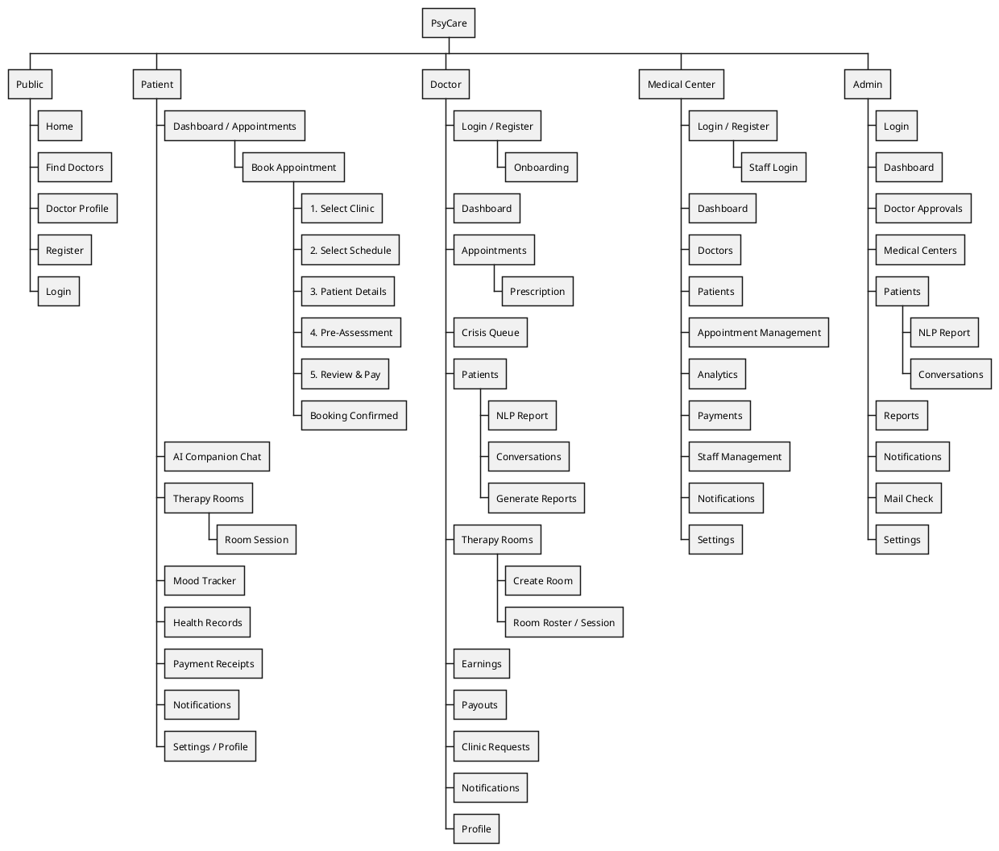

# PsyCare — Sitemap

Page-level sitemap (not every action/API route — downloads, "mark read", signaling endpoints, etc.
are omitted for readability) derived from [`routes/web.php`](../../routes/web.php). Root at top,
branching into the five top-level sections: **Public**, **Patient**, **Doctor**,
**Medical Center**, and **Admin**. Same PsyCare green theme as the other diagrams (`#0F7A4C`
borders / `#E7F5EC` fills).

---

## 1. Mermaid

```mermaid
flowchart TD
    classDef root fill:#0F7A4C,stroke:#0B4A2F,stroke-width:1.5px,color:#FFFFFF
    classDef section fill:#2E9E5B,stroke:#0F7A4C,stroke-width:1.5px,color:#FFFFFF
    classDef page fill:#E7F5EC,stroke:#0F7A4C,stroke-width:1.2px,color:#0B4A2F

    Root[PsyCare]:::root

    Root --> Public[Public]:::section
    Root --> Patient[Patient]:::section
    Root --> Doctor[Doctor]:::section
    Root --> MedicalCenter[Medical Center]:::section
    Root --> Admin[Admin]:::section

    Public --> P1[Home]:::page
    Public --> P2[Find Doctors]:::page
    Public --> P3[Doctor Profile]:::page
    Public --> P4[Register]:::page
    Public --> P5[Login]:::page

    Patient --> Pa1[Dashboard / Appointments]:::page
    Pa1 --> Pa1a[Book Appointment]:::page
    Pa1a --> Pa1a1[1. Select Clinic]:::page
    Pa1a --> Pa1a2[2. Select Schedule]:::page
    Pa1a --> Pa1a3[3. Patient Details]:::page
    Pa1a --> Pa1a4[4. Pre-Assessment]:::page
    Pa1a --> Pa1a5[5. Review & Pay]:::page
    Pa1a --> Pa1a6[Booking Confirmed]:::page
    Patient --> Pa2[AI Companion Chat]:::page
    Patient --> Pa3[Therapy Rooms]:::page
    Pa3 --> Pa3a[Room Session]:::page
    Patient --> Pa4[Mood Tracker]:::page
    Patient --> Pa5[Health Records]:::page
    Patient --> Pa6[Payment Receipts]:::page
    Patient --> Pa7[Notifications]:::page
    Patient --> Pa8[Settings / Profile]:::page

    Doctor --> D1[Login / Register]:::page
    D1 --> D1a[Onboarding]:::page
    Doctor --> D2[Dashboard]:::page
    Doctor --> D3[Appointments]:::page
    D3 --> D3a[Prescription]:::page
    Doctor --> D4[Crisis Queue]:::page
    Doctor --> D5[Patients]:::page
    D5 --> D5a[NLP Report]:::page
    D5 --> D5b[Conversations]:::page
    D5 --> D5c[Generate Reports]:::page
    Doctor --> D6[Therapy Rooms]:::page
    D6 --> D6a[Create Room]:::page
    D6 --> D6b[Room Roster / Session]:::page
    Doctor --> D7[Earnings]:::page
    Doctor --> D8[Payouts]:::page
    Doctor --> D9[Clinic Requests]:::page
    Doctor --> D10[Notifications]:::page
    Doctor --> D11[Profile]:::page

    MedicalCenter --> M1[Login / Register]:::page
    M1 --> M1a[Staff Login]:::page
    MedicalCenter --> M2[Dashboard]:::page
    MedicalCenter --> M3[Doctors]:::page
    MedicalCenter --> M4[Patients]:::page
    MedicalCenter --> M5[Appointment Management]:::page
    MedicalCenter --> M6[Analytics]:::page
    MedicalCenter --> M7[Payments]:::page
    MedicalCenter --> M8[Staff Management]:::page
    MedicalCenter --> M9[Notifications]:::page
    MedicalCenter --> M10[Settings]:::page

    Admin --> A1[Login]:::page
    Admin --> A2[Dashboard]:::page
    Admin --> A3[Doctor Approvals]:::page
    Admin --> A4[Medical Centers]:::page
    Admin --> A5[Patients]:::page
    A5 --> A5a[NLP Report]:::page
    A5 --> A5b[Conversations]:::page
    Admin --> A6[Reports]:::page
    Admin --> A7[Notifications]:::page
    Admin --> A8[Mail Check]:::page
    Admin --> A9[Settings]:::page
```

---

## 2. PlantUML

Using PlantUML's WBS (work breakdown structure) syntax, which renders the same top-down
org-chart-style tree.

---

## Notes for the report

- Trimmed to page-level routes (what a user would recognize as a distinct screen); action-only
  endpoints — download, mark-notification-read, WebRTC signaling, kick-participant, etc. — are
  intentionally left out to keep the tree readable, matching the scale of the reference sitemap.
- The 5-step booking wizard is nested under **Patient → Book Appointment** since it's one flow
  across 5 pages (see the [activity diagram](ACTIVITY_DIAGRAM.md) for that flow in detail).
- Each of the 4 non-public sections (Patient, Doctor, Medical Center, Admin) corresponds to one
  auth guard in [`config/auth.php`](../../config/auth.php).
