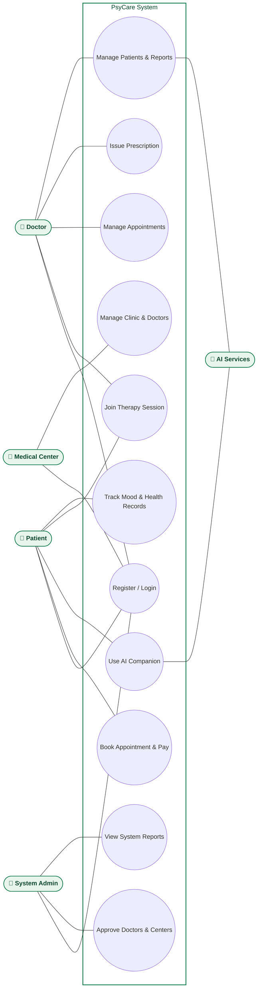
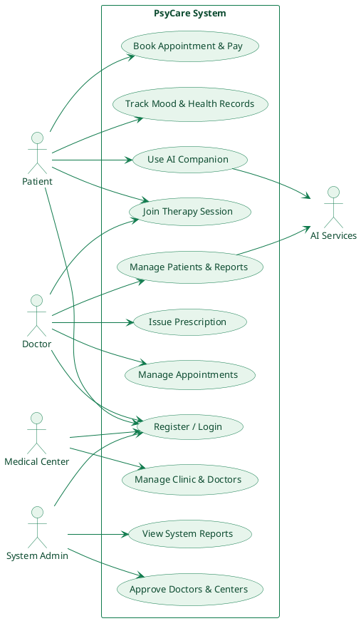

# PsyCare — Use Case Diagram

Simplified to the core use cases per actor, derived from [`routes/web.php`](../../routes/web.php)
and the guard-scoped controllers in [`app/Http/Controllers`](../../app/Http/Controllers). Same
PsyCare green theme as the architecture diagram (`#0F7A4C` borders / `#E7F5EC` fills).

---

## 1. Mermaid

Mermaid has no native UML use-case shape, so it's modelled as a `flowchart`: one system-boundary
box holding every use case as an oval, with stick-figure actors outside it connecting straight to
their ovals — no per-actor boxes.

---

## 2. PlantUML

Native UML use-case notation, styled with the same PsyCare green theme.

---

## Notes for the report

- **Patient**, **Doctor**, **Medical Center**, and **System Admin** map to the four auth guards in
  [`config/auth.php`](../../config/auth.php) (`web`, `doctor`, `medical_center`, `admin`).
- **AI Services** is one combined supporting actor standing in for both the Python NLP
  microservice and Gemini/Google TTS (see the [architecture diagram](ARCHITECTURE_DIAGRAM.md) for
  the detailed split) — used by "Use AI Companion" (patient chat) and "Manage Patients & Reports"
  (doctor NLP report generation).
- Use cases are deliberately broad groupings (e.g. "Manage Appointments" covers view/accept/
  reschedule) to keep the diagram readable. Let me know if you'd like any group split out further.
