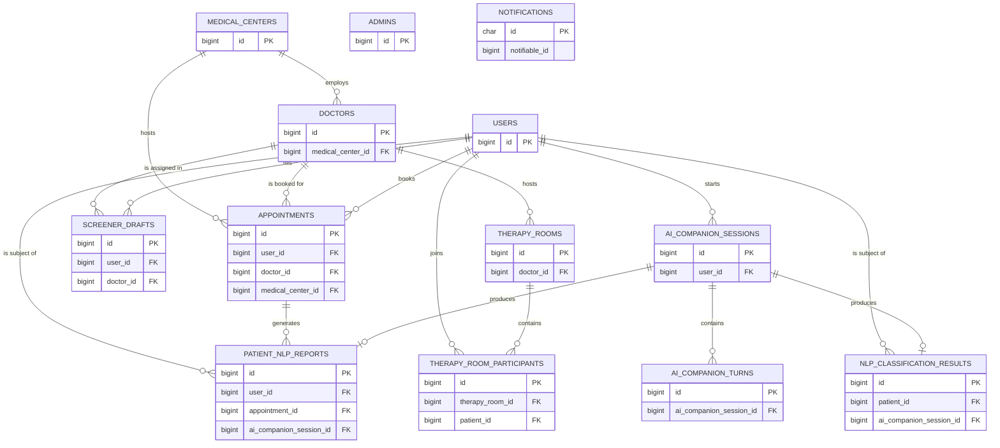

# PsyCare — Entity Relationship Diagram

Generated from the application's migrations (`database/migrations/`) and Eloquent model relationships (`app/Models/`).

> Note: Laravel infrastructure tables (`cache`, `cache_locks`, `jobs`, `job_batches`, `failed_jobs`, `sessions`, `migrations`, `password_reset_tokens`) are intentionally omitted — they carry no domain meaning for this diagram.

## Notes on relationships

- **MEDICAL_CENTERS → DOCTORS** (1:N): a medical center employs many doctors (`doctors.medical_center_id`).
- **MEDICAL_CENTERS → APPOINTMENTS** (1:N): appointments are tied to the medical center they're booked at.
- **DOCTORS → APPOINTMENTS / SCREENER_DRAFTS / THERAPY_ROOMS** (1:N each).
- **USERS** (patients) fan out into appointments, screener drafts, AI companion sessions, NLP reports/results, and therapy room participation.
- **APPOINTMENTS → PATIENT_NLP_REPORTS** (1:N): a completed screener/AI session can generate a report tied to the appointment it supports.
- **AI_COMPANION_SESSIONS → AI_COMPANION_TURNS** (1:N): the conversational turns of a chat session.
- **AI_COMPANION_SESSIONS → PATIENT_NLP_REPORTS** and **→ NLP_CLASSIFICATION_RESULTS** (1:0..1 each, via `AiCompanionSession::report()` / `classificationResult()` `hasOne`): each session can produce at most one report and one classification result.
- **THERAPY_ROOMS → THERAPY_ROOM_PARTICIPANTS** (1:N), and `THERAPY_ROOM_PARTICIPANTS` is the pivot realizing the **DOCTORS/THERAPY_ROOMS ↔ USERS** many-to-many (`TherapyRoom::patients()` `belongsToMany`).
- **NOTIFICATIONS** is Laravel's polymorphic notifications table (`notifiable_type` + `notifiable_id`); it isn't linked with a fixed FK since it can point at any notifiable model (currently `Doctor`/`User`/`MedicalCenter` depending on notification usage), so it's shown standalone rather than with a drawn relationship.
- **ADMINS** has no foreign-key relationships to other domain tables in the current schema — shown standalone.

Full column-level detail (all attributes, enums, types) lives in `database/migrations/` — this diagram intentionally shows only keys, to keep entities and relationships readable at a glance.

Source of truth: re-derive this diagram from `database/migrations/` and `app/Models/` if the schema changes — it is not auto-generated.
